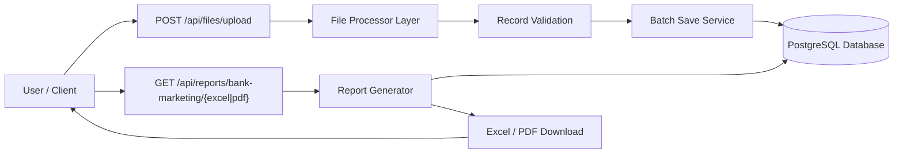
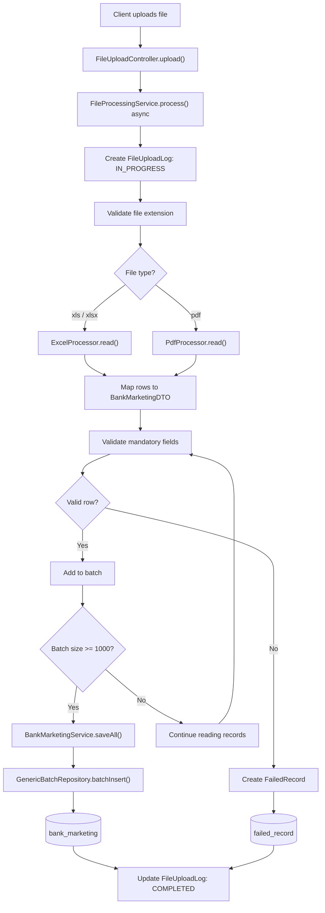
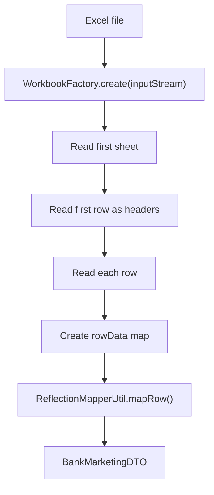
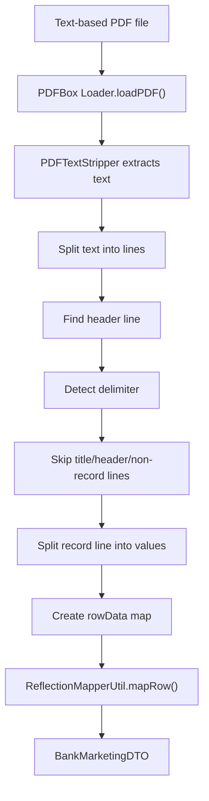
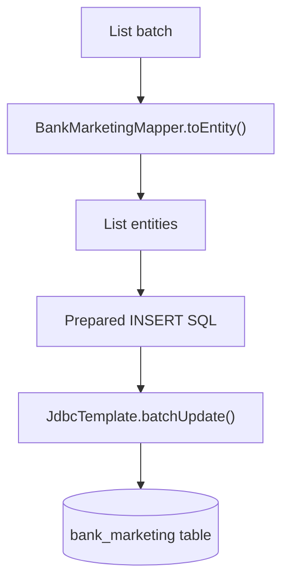
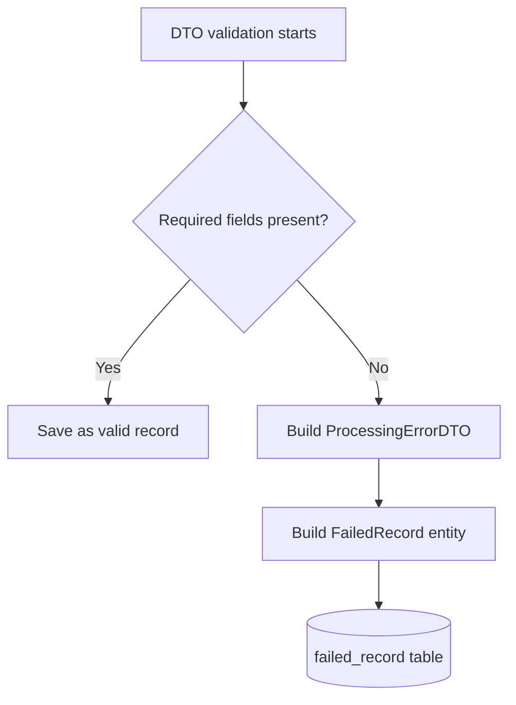
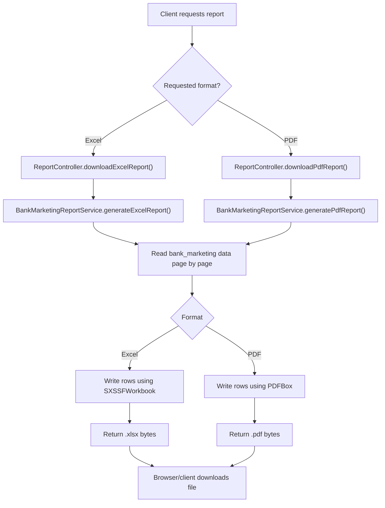
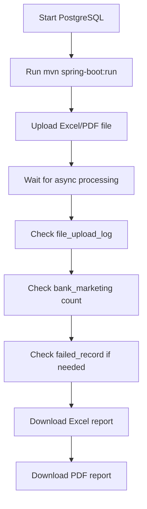

# File Processing Application Documentation

## Project Overview

`fileprocessApp` is a Spring Boot application for uploading large Excel/PDF files, reading bank marketing records, saving valid records into PostgreSQL, logging upload status, storing failed records, and generating downloadable reports from database data.

The application currently supports:

- Uploading `.xls`, `.xlsx`, and `.pdf` files.
- Reading Excel data through Apache POI.
- Reading text-based PDF data through Apache PDFBox.
- Mapping uploaded rows into `BankMarketingDTO`.
- Validating mandatory fields.
- Saving valid records into the `bank_marketing` table using JDBC batch insert.
- Saving invalid records into the `failed_record` table.
- Tracking file upload status in the `file_upload_log` table.
- Generating Excel reports from database data.
- Generating PDF reports from database data.

## Technology Stack

| Layer | Technology |
| --- | --- |
| Language | Java 21 |
| Framework | Spring Boot 3.5.15-SNAPSHOT |
| REST API | Spring Web |
| Database | PostgreSQL |
| ORM | Spring Data JPA / Hibernate |
| Batch Insert | Spring `JdbcTemplate` |
| Excel Read/Write | Apache POI |
| PDF Read/Write | Apache PDFBox |
| Boilerplate Reduction | Lombok |
| Build Tool | Maven |

## Project Structure

```text
src/main/java/com/file/fileprocess
|-- annotation
|   `-- ExcelColumn.java
|-- batch
|   `-- GenericBatchRepository.java
|-- config
|   `-- AsyncConfig.java
|-- controller
|   |-- FileUploadController.java
|   `-- ReportController.java
|-- dtos
|   |-- ApiResponseDTO.java
|   |-- BankMarketingDTO.java
|   |-- FileProcessingResultDTO.java
|   `-- ProcessingErrorDTO.java
|-- Exceptions
|   |-- FileDatabaseException.java
|   |-- FileParsingException.java
|   |-- FileValidationException.java
|   `-- GlobalExceptionHandler.java
|-- mapper
|   `-- BankMarketingMapper.java
|-- model
|   |-- BankMarketing.java
|   |-- FailedRecord.java
|   `-- FileUploadLog.java
|-- process
|   |-- AbstractFileProcessor.java
|   |-- ExcelProcessor.java
|   |-- FileProcessor.java
|   |-- PdfProcessor.java
|   `-- ProcessorFactory.java
|-- repository
|   |-- BankMarketingRepository.java
|   |-- FailedRecordRepository.java
|   `-- FileUploadLogRepository.java
|-- services
|   |-- BankMarketingReportService.java
|   |-- BankMarketingService.java
|   `-- FileProcessingService.java
|-- util
|   |-- ReflectionMapperUtil.java
|   `-- UuidGeneratorUtil.java
`-- FileprocessAppApplication.java
```

## Database Configuration

Database settings are configured in:

```text
src/main/resources/application.yaml
```

Current local configuration:

```yaml
spring:
  datasource:
    url: jdbc:postgresql://localhost:5432/file_processing_db
    username: postgres
    password: root
```

For public Git repositories or production deployment, move the username and password into environment variables.

Example:

```yaml
spring:
  datasource:
    url: ${DB_URL}
    username: ${DB_USERNAME}
    password: ${DB_PASSWORD}
```

## Database Tables

The application uses JPA entities and `ddl-auto: update`, so Hibernate can create/update tables automatically.

### `bank_marketing`

Stores valid uploaded records.

Main entity:

```text
BankMarketing.java
```

Important columns:

- `id`
- `age`
- `job`
- `marital`
- `education`
- `default_status`
- `housing`
- `loan`
- `contact`
- `month`
- `day_of_week`
- `duration`
- `campaign`
- `pdays`
- `previous`
- `poutcome`
- `emp_var_rate`
- `cons_price_idx`
- `cons_conf_idx`
- `euribor3m`
- `nr_employed`
- `yes_no`

### `file_upload_log`

Stores upload status and counts.

Typical statuses:

- `IN_PROGRESS`
- `COMPLETED`
- `FAILED`

### `failed_record`

Stores rows that failed validation or processing.

Useful for debugging uploaded files without losing bad rows.

## File Upload API

### Upload Excel Or PDF

```http
POST /api/files/upload
```

Form field:

```text
file
```

Supported extensions:

- `.xls`
- `.xlsx`
- `.pdf`

PowerShell example:

```powershell
curl.exe -X POST "http://localhost:8080/api/files/upload" `
  -F "file=@E:\workspaceINTELLIJ\fileprocessApp\outputs\bank-additional-full.pdf"
```

Successful response:

```json
{
  "success": true,
  "message": "File uploaded"
}
```

The upload process runs asynchronously, so the API can return before the file has fully finished processing.

## Upload Validation Rules

Each row must satisfy:

- Record must not be null.
- `age` is mandatory.
- `job` is mandatory.
- `marital` is mandatory.

Current validation lives in:

```text
FileProcessingService.validateRecord()
```

## Excel Upload Behavior

Excel files are read by:

```text
ExcelProcessor.java
```

Behavior:

1. Reads the first sheet.
2. Reads the first row as headers.
3. Converts each row into a `Map<String, String>`.
4. Maps the row into `BankMarketingDTO` using `@ExcelColumn`.
5. Sends records to the service layer for validation and saving.

## PDF Upload Behavior

PDF files are read by:

```text
PdfProcessor.java
```

Behavior:

1. Reads PDF text using Apache PDFBox.
2. Finds the header row.
3. Detects delimiter.
4. Skips page title lines.
5. Skips incomplete or invalid lines.
6. Maps valid rows into `BankMarketingDTO`.

Important limitation:

The PDF must be text-based. Scanned image PDFs need OCR and are not currently supported.

## Batch Save Behavior

Valid records are saved by:

```text
BankMarketingService.java
```

The service maps DTOs into entities and inserts them using:

```text
GenericBatchRepository.java
```

Batch size:

```java
private static final int BATCH_SIZE = 1000;
```

This makes the application suitable for large uploads such as 100,000 records.

## Report Download APIs

Reports are generated from the `bank_marketing` database table.

### Excel Report

```http
GET /api/reports/bank-marketing/excel
```

PowerShell:

```powershell
curl.exe -L "http://localhost:8080/api/reports/bank-marketing/excel" `
  -o "E:\workspaceINTELLIJ\fileprocessApp\outputs\bank-marketing-report.xlsx"
```

### PDF Report

```http
GET /api/reports/bank-marketing/pdf
```

PowerShell:

```powershell
curl.exe -L "http://localhost:8080/api/reports/bank-marketing/pdf" `
  -o "E:\workspaceINTELLIJ\fileprocessApp\outputs\bank-marketing-report.pdf"
```

Report generation is implemented in:

```text
BankMarketingReportService.java
```

The service reads database records in pages of `1000`, so report generation does not need to load the full database table at once.

## Running The Application

Start PostgreSQL and ensure this database exists:

```text
file_processing_db
```

Run the application:

```powershell
mvn spring-boot:run
```

Application URL:

```text
http://localhost:8080
```

## Running Tests

```powershell
mvn test
```

## Common Testing Flow

1. Start PostgreSQL.
2. Start the Spring Boot app.
3. Upload Excel or PDF file.
4. Check upload status:

```sql
select * from file_upload_log order by upload_time desc;
```

5. Check inserted records:

```sql
select count(*) from bank_marketing;
```

6. Check failed records:

```sql
select * from failed_record order by failed_at desc;
```

7. Download Excel report.
8. Download PDF report.

## Git Push Steps

If this project is not already a Git repository:

```powershell
cd E:\workspaceINTELLIJ\fileprocessApp
git init
git add .
git commit -m "Add file upload and report generation"
git remote add origin https://github.com/your-username/fileprocessApp.git
git branch -M main
git push -u origin main
```

## Known Limitations

- PDF upload supports text-based PDFs only.
- Scanned PDFs require OCR before parsing.
- Very large PDF reports can produce many pages.
- Upload endpoint reads uploaded file bytes before processing; for very large files, using a stream or temporary file would be more memory efficient.
- The app currently uses local DB credentials in `application.yaml`; use environment variables before public deployment.


# File Processing Application Workflow

## High-Level System Flow



## Upload Workflow



## Excel Upload Workflow



## PDF Upload Workflow



## Batch Insert Workflow



## Failed Record Workflow



## Report Generation Workflow



## Main API Workflow

### Upload A File

```text
POST http://localhost:8080/api/files/upload
```

Input:

```text
multipart/form-data
file=<Excel or PDF file>
```

Output:

```json
{
  "success": true,
  "message": "File uploaded"
}
```

### Download Excel Report

```text
GET http://localhost:8080/api/reports/bank-marketing/excel
```

Output:

```text
bank-marketing-report.xlsx
```

### Download PDF Report

```text
GET http://localhost:8080/api/reports/bank-marketing/pdf
```

Output:

```text
bank-marketing-report.pdf
```

## End-To-End Test Workflow



## Recommended Production Improvements

- Replace `file.getBytes()` with stream/temp-file processing for very large uploads.
- Move database credentials to environment variables.
- Add report filters, such as date, job, marital status, or result.
- Add pagination or asynchronous report generation for extremely large PDFs.
- Add OCR support if scanned PDFs are required.
- Add integration tests for Excel upload, PDF upload, Excel report, and PDF report.


